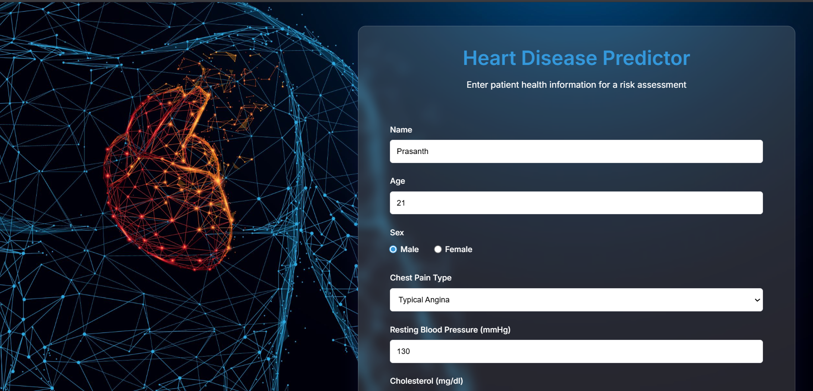
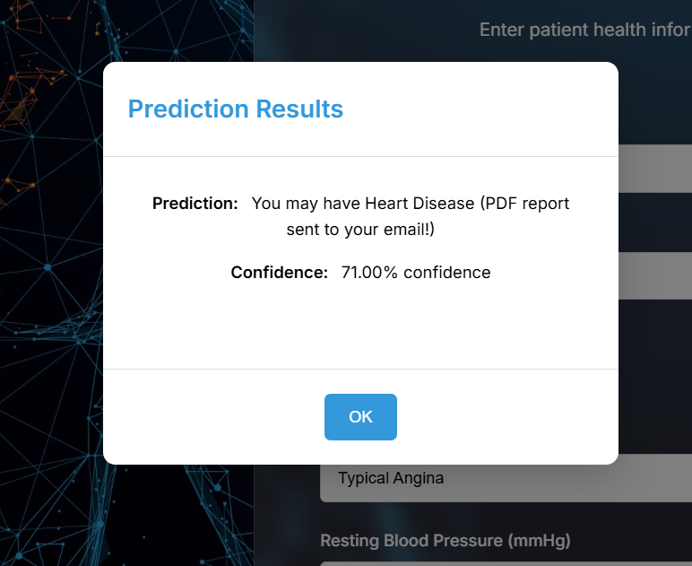
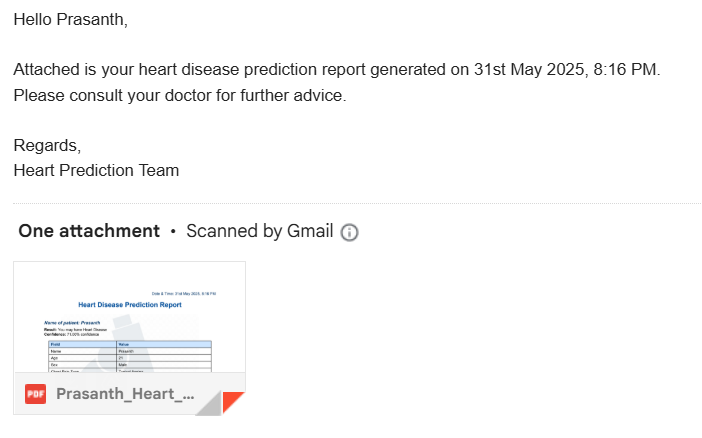
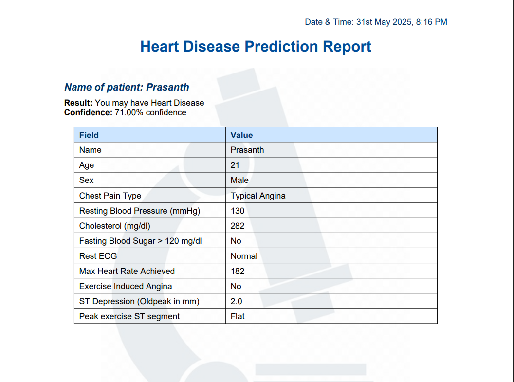
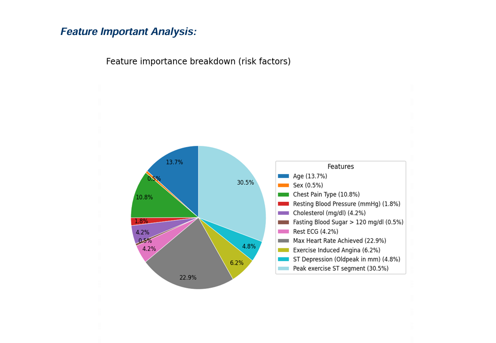

# ❤️ Heart Disease Prediction Web App

A Django-based web application that predicts the likelihood of heart disease using a **Random Forest** model. Users input health-related data, and the app generates a **personalized PDF report** containing the prediction result, model confidence, and feature importance visualization using **SHAP**. The report is automatically emailed to the user.

---

## 🚀 Features

* 🧑‍🧬 **Machine Learning Model**: Random Forest classifier trained on structured health data.
* 🌐 **Django Web Interface**: Clean and interactive form-based UI for user input.
* 📊 **SHAP Explainability**: Visualizes per-instance feature contributions via a pie chart.
* 📄 **PDF Report Generation**: Auto-generates a professional report with:

  * User's input data
  * Prediction outcome
  * Confidence score
  * SHAP-based feature importance chart
* 📧 **Email Integration**: Sends the report directly to the user's email.

---

## 💠 Tech Stack

| Component        | Technology                   |
| ---------------- | ---------------------------- |
| Backend          | Django (Python)              |
| Machine Learning | Random Forest (scikit-learn) |
| Explainability   | SHAP                         |
| PDF Generation   | ReportLab and  matplotlib       |
| Email Service    | Django Email backend         |
| Frontend         | HTML, CSS, Bootstrap         |

---

## 📸 Screenshots

> ### 🧾 User Input Form


### 📈 Prediction Result on Website


### 📬 Email with PDF Report


### 📄 Sample PDF Report


### 🥧 SHAP Feature Importance Pie Chart



---

## ⚙️ Installation

1. **Clone the Repository**

   ```bash
   git clone https://github.com/yourusername/heart-disease-prediction.git
   cd heart-disease-prediction
   ```

2. **Create a Virtual Environment**

   ```bash
   python -m venv venv
   source venv/bin/activate  # On Windows: venv\Scripts\activate
   ```

3. **Install Dependencies**

   ```bash
   pip install -r requirements.txt
   ```

4. **Run the Django Server**

   ```bash
   python manage.py runserver
   ```

5. **Access the App**
   Open `http://127.0.0.1:8000/` in your browser.

---

## 📬 Configuration

* Update your **email backend** settings in `settings.py` for sending reports.
* Ensure proper SMTP credentials are used (e.g., Gmail, SendGrid, etc.).

---

## 🧲 Example Prediction Workflow

1. User fills in the form with medical data.
2. ML model predicts risk (e.g., "High Risk of Heart Disease").
3. SHAP computes feature contribution.
4. A PDF report is created and emailed to the user.
